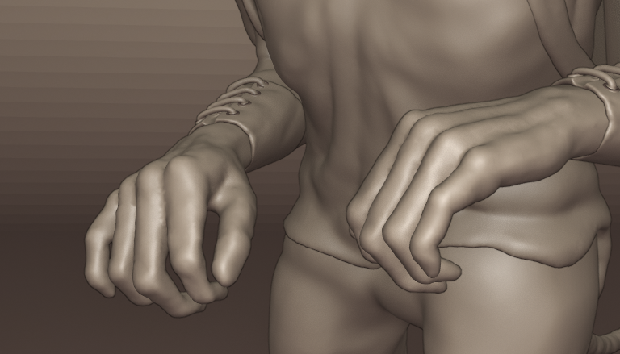
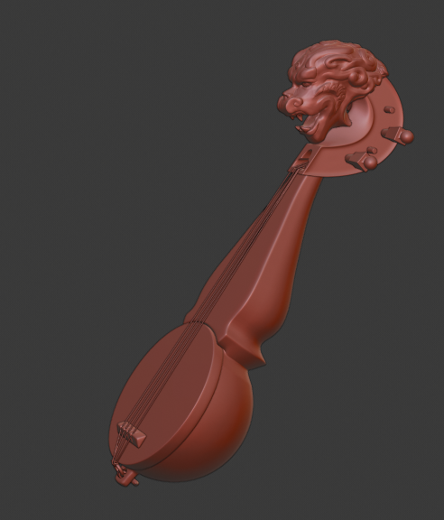

This is a piece I made in 2019 in Blender 2.80. I posted my progress over on [blender artists](https://blenderartists.org/t/imp-traveller-finished/1159725/9) in the Works in Progress category and I'm reposting a version of that content here. In another post I'll follow up on how I crested a full scene after I did the blender artists' post. I also converted the model for 3D printed and had a SLS nylon print made. The original concept artist is now painting that model and I'll post some photos when he's done.

# Blocking in

I've been working my way through Zacharias Reinhardt's [Mastering Sculpting Course](https://academy.cgboost.com/p/mastering-sculpting-in-blender) and I can highly recommend it. This character is my first piece of independent work where I'll try to put into practice a lot of what I've learnt on the course. I've still got a heap to learn, so when I get stuck and follow another tutorial I'll also link to that.

Here's my concept art. It's by my multi-talented partner over at http://techmonkeybusiness.com/

I need a definite idea of what I'm making at the start of a project, especially when I'm learning a new skill like digital sculpting. After making a change, I find it  much easier to decide if the change makes my work closer to the concept reference, than to decide if the change has made the work "better".

I'm working in Blender 2.8 and intending to do the rendering in Eevee.

I started off by blocking the pose in with a posed model I made in MakeHuman. I got started with Makehuman via this [BlenderforNoobs video](https://www.youtube.com/watch?v=tCbB_perbes.)

I've use skin modifiers for the base meshes for the head, tail and shoes. Grant Abbitt's tutorial [Quickly Create Base Meshes for Sculpting Skin modifier Blender 2.8 - YouTube](https://www.youtube.com/watch?v=wCI8ZbTBP1w) was helpful here.

The clothes as they come across from MakeHuman are thin meshes which I found difficult to work with. I found it easier to select the corresponding area of the body mesh duplicate it, and fill it in top and bottom to make  solid shape to sculpt on.You can see below I've done this for the trousers which are working well, but I'm struggling a bit with the shirt.

The hands I completed as a separate sculpt, which I'll cover in  my next update.

# Hands

In between or alongside big projects, I find it great to do some smaller practice pieces. Bits of bodies are good, eyes, hands ears. They may come in useful (handy!) as meshes for other projects, but the main benefit is focused sculpting where I can relax as it's only a practice piece. Speed sculpting is another way to practice, but I find at my skill level my results in a short time can be disappointing. Concentrating on small bits of a sculpt for a short time or setting a target for a session helps me make progress without getting bogged down in detail,

I watched a few videos on hands [3D hand timelapse - YouTube](https://www.youtube.com/watch?v=AGdTnapvnko), [Sculpting Hands In Blender - YouTube](https://www.youtube.com/watch?v=ijVZQ-pn65s), [How to Sculpt hands  Sculpt Jan 2019  no. 17 - YouTube](https://www.youtube.com/watch?v=L4UOz1Sygrw). It seems getting the proportions right is hard but also hands vary  a lot.

I downloaded a scan of a real hand from [Sketchfab](https://skfb.ly/6Hpxs) and sculpted a very low resolution mesh over this. I did this by hand - not using snapping or shrink wrapping. At this stage the fingers and thumb were separate pieces.

I then booleaned the pieces together, and started sculpting in dyntopo mode.

I then went back to the base mesh, to sculpt some hands more suited to my Imp. I used images and drawings of Chimpanzee hands as reference. Consultation with my concept artist, suggested hands with long slender proportions, but with human thumbs not the short Chimpanzee thumb.

I'm never sure how much detail to put in here. In a render of the full body of the Imp we're not going to see pores or veins on the hands. I try to stop at a fit for purpose level of detail. I can always go back again. This is about learning, not modelling for production.

Next I'll be working on the head.

# Head

Starting on the head, I put the concept art on an image empty and sculpted the mesh trying to block in as much as possible at a low resolution.

I'm using dyntopo, but I've flooded the mesh with a constant detail. I've also got symmetry turned on. I'll go into a couple of finer levels of detail but I'm still a bit unsure when to remesh and go to a multi-resolution modifier.

Here's where I decided to stop sculpting in dyntopo. The mesh has ~67k faces.

Next, I exported the mesh as an obj and remeshed in Instant Meshes. The output mesh has ~4k faces. I've found that my machine (Intel© Core™ i7 CPU 860  @ 2.80GHz × 4 with 16 GB RAM) is more responsive when when sculpting high detail in multires mode if I keep the base mesh with fewer faces and do more subdivisions than if the base mesh has more faces and fewer subdivisions.

The mesh from Instant Meshes was a bit twisted around the nose so I made it symmetric, choosing the better side. I then applied a multires modifier with 3 subdivisions and a shrinkwrap modifier with the 67k mesh as the target. Once the shrinkwrap modifier was applied I kept sculpting. I'm trying to step up and down the different subdivision levels, so detail happens at the fine levels, but say overall smoothing works better at less subdivisions. I haven't really got the hang of this yet.

Here's an intermediate step:

And where I'm at now:

I'm reasonably happy with this level of detail. I'm not going for a super realistic look with very fine detail. I'm now at about 534 k faces.

Next I'm going to look at the pack, although there's still hair and eyes and better clothes...

# Pack

The pack actually almost came before the Imp. I wanted to practice the luggage, ropes and belts parts of Zacharias Reinhardt's Mastering Sculpting Course, and was hunting for reference images. My partner pulled out an old sketch book with a sketch of this little imp carrying a big pack with a lute strapped to the back. That inspired this project. The sketch showed the character from the front so I kept image searching for a more detailed reference and came across photos of Japanese Imperial army packs from WWII. (image search "octopus Japanese rucksack). I liked the concept of bows tying everything onto a pack. This Imp is only about 40 cm tall and would have difficulty finding lots of tiny buckles.

Here's a series of images from blocked in to almost complete. As I narrowed in on the creature sculpt I dropped the spade in favour of the lute.

I enjoyed trying to get the wrinkles looking like the straps were pulling them tight.

# Lute

The lute was a project in itself. I probably sculpted far more detail than was needed, especially if the main render is going to be from the front.

My reference for this was Tibetan lutes like this one.

I blocked in the main shapes with subdivision modelling. I'm keeping to the proportions of the reference, even though I think the lute will need to be much shorter in the body to match the Imp.

I then worked mainly on the head and treated it as a character sculpt. Here I'm at about 380k faces. The teeth and eyes are separate objects.

I've probably kept going on this one too long in dyntopo mode before remeshing and moving to a Multires modifier.

Here's where I stopped and finally remeshed

Here's the output from Instant Meshes, its got 1k faces.

I wondered if I'd gone to coarse on the remesh but I though I'd give it a try, and see how low I could go. It seemed to work.

As with the Imp head, I added a multires modifier (this time 6 sub-divisions), shrink wrapped to the high resolution mesh, applied the shrinkwrap and keep on sculpting.

I called it done about here

I was aiming for a wood carving look, which needed a mix between soft curves but well defined edges. I didn't get this as good as I wanted.

This Grant Abbitt video was helpful https://www.youtube.com/watch?v=jBUzQN4dyE4. Also see this one https://www.youtube.com/watch?v=X7Jj9xTFBrA&t by Craig Jones.

The rest of the lute was just poly modelling, with beziers for the strings.

Again I probably went overboard on detail that won't be seen, but I'm doing this for fun... it's my time!

Next, I need to get back to the Imp. probably the hair, but the eyes still need doing.

# Hair and Eyes

There's at least 3 ways of doing hair; curves, particles and sculpting. Curves seemed my best bet here. I pretty much followed this tutorial [Blender Tutorial - Hair With Curves - YouTube](https://www.youtube.com/watch?v=t2XjdzzWCqI), with some extra help from Yan [Modeling Hair In Blender For Beginners - Tutorial - YouTube](https://www.youtube.com/watch?v=bfdbTD9Bxpg).

I had to google around a bit to work out how to set the transparency in Eevee to get the scalp ends of the hair right.
(set Material -> Settings -> Blend Mode to one of the alpha settings)

All the tutorials seem to do eyes in a similar way. A sphere with a convex outer cornea, and an inner sphere with a concave iris and pupil.

I mostly followed these tutorials [Byteweiser Tutorial: Making a Cartoon Eyeball and Iris - Part1 - YouTube](https://www.youtube.com/watch?v=7sZrtSwahUA) and [Part2](https://www.youtube.com/watch?v=Lmq4XgJZRjg).

I’ve had to move to Eevee renders to look at the hair and eye texture. So I’ve given everything a default texture. Next I’ll play around with the lighting and texture a bit more. But I finally feel the project is coming together.

# Lighting and skin texture

To do the hair transparency, I had to move from working in matcap mode to Eevee. So about then I started putting some very simple textures onto everything. I liked the simplicity the matcap multi material look and I don't want to (haven't got the skills yet) to go down the realistic route. All the materials are simple principled BSDFs, very close to the default material.

The skin texture is very simple, with some translucency. Without any noise on the skin its looks very plastic or waxy.

But it looks better with some noise added to the normals.

I messed around a lot with the lighting and colour palette. Eventually going for more drab colours and darker but defined lighting. I'm envisaging him standing in a forest clearing with bright sunlight from above. I don;t want to render the whole scene, but having a fixed idea of where the character might be, helped in my lighting choices.

Early on

Later:

Close to final:

The last image is close to the final lighting setup. There are three area lights and an HDRI light. The most useful lighting advice I found was to audition each light on its own, and then in combination with each light off in turn. Each light should have its defined purpose. You should see a positive effect when you turn the light back on. The HDRI light has the least effect in the above image.

I thought of adding cloth textures to the clothes, and some colour variation to the face (vertex or texture painting) but I'm ready to move on to the next piece.

That shirt still needs some attention. I'll do that next.

# Clothes - wrinkles

I've been slowly refining the clothes as I go. With  a full character like this, I found moving from part to part kept me engaged However the shirt isn't right.

Wrinkles are hard. They depend a lot on the weight and type of fabric and when watching people they move. I looked at Burne Hogarth's book Dynamic Wrinkles and Drapery, but I found my best research was looking at peoples clothes in meetings when they were sitting still. I also took some photos of my partner in a fleece top. The style suited the stronger wrinkles of a heavier fabric.

I redid the elbow and shoulder wrinkles several times until I was bored. This is where I ended up.

Very early on in this piece, I spent a lot of time agonising over the collar on that shirt. Right at the end I went over is quickly with inflate and blob brushes erasing all that early work and giving a heavier look that was in keeping with the new fabric weight. Figuring out when and where to put the effort in, is a big part of the sculpting learning process.

The shoes and braces have some more dents and wrinkles as well.

Next I'll do some final renders and a turntable animation.

# Finishing up

It's done!

The whole process of irradiance volumes and baked indirect lighting in Eevee was new to me. I found these tutorials helpful. [EEVEE Light Probes for Reflections: Blender 2.8 Tutorial - YouTube](https://www.youtube.com/watch?v=JjzilEjjpws), [Blender 2.80 Tutorial - Eevee Probe - Irradiance Volume - YouTube](https://www.youtube.com/watch?v=FnxzZe2ZKHs)

I wanted to have a finished output for this piece that showed all sides of the work. I looked at the process to get it Sketchfab ready, but I've still got a heap to learn about the UV texturing and baking process.

Instead I went for a turntable animation. The high poly count makes for a slower render, but in Eevee its going to be much faster rendering than my time doing all the retopo, UV baking steps.

For a turntable animation you can either rotate the model or the camera. I tried one of each. For the full figure I rotated the model, forThe two things I enjoyed most about this pie the close-ups I moved the camera along a path.

I added a base and used a texture haven texture for the ground. I redid the tail to curl around more like the original concept art and to fit inside the base. I also made sure the shoes looked like they were on the ground.

<iframe width="885" height="498" src="https://www.youtube.com/embed/LVsJ2B5fFKs" frameborder="0" allow="accelerometer; autoplay; clipboard-write; encrypted-media; gyroscope; picture-in-picture" allowfullscreen></iframe>

For the close ups, I hid the backdrop and used a path animation for the camera. See this tutorial [][][]. Because I wanted to circle around both the lute head and the imp head, I shifted the camera target empty between the two heads during the animation. The half circle around the lute was smaller than that around the imp but I wanted then to take about the same time. I was getting some odd errors but this post helped  [][] with animating the "Evaluation Time" of the path animation.

<iframe width="897" height="505" src="https://www.youtube.com/embed/tAAvlNVzWMM" frameborder="0" allow="accelerometer; autoplay; clipboard-write; encrypted-media; gyroscope; picture-in-picture" allowfullscreen></iframe>

I worked on this piece for about three months using maybe a quarter to a third of my spare time, including all the you-tube videos I watched. Of the processes, I enjoyed the sculpting the most, but I’ve also enjoyed learning all the new stuff through the other stages. I’ve really surprised myself with how much I improved in those three months.
