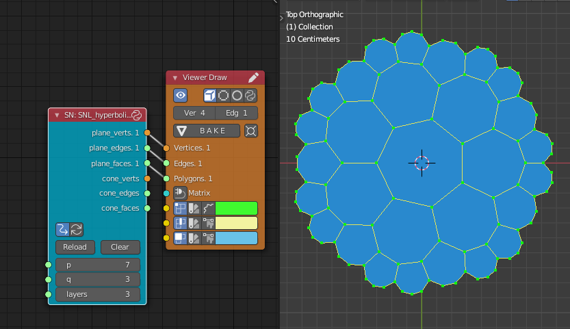

At the request of a reader, I've updated my [Sverchok](http://nortikin.github.io/sverchok/) node for making hyperbolic tilings in Blender. There's now a "Script Node Lite" node that works with the latest versions of Sverchok (vstable7) and Blender (2.92).  

The [node code](https://github.com/elfnor/hyperbolic_coral) can be found over on github, along with an example Blender file. For some things to do with it see a couple of my old posts,   [Painting in the Hyperbolic Plane](https://elfnor.com/painting-in-the-hyperbolic-plane.html) and  [Hyperbolic Tiling in 3D](https://elfnor.com/hyperbolic-tiling-in-3d.html). 

These posts mostly make sense it Blender 2.92, for someone a bit familiar with older versions. I haven't tried the soft body physics lately, as I had a lot better success with doing the 3D unfurling in processing, see  [Larger Hyperbolic Tilings in 3D using Processing](https://elfnor.com/larger-hyperbolic-tilings-in-3d-using-processing.html)

