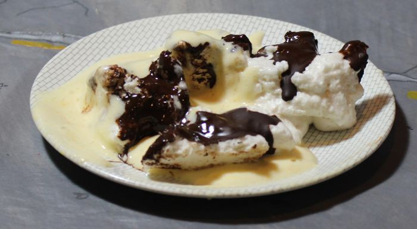

This time last year, hereabouts, we were in lock-down with our team of 5 million pursuing a strategy to eliminate COVID-19.  I'd recently done a big supermarket shop, and I wasn't going to brave the long queue again when I realised we had **no** marshmallow eggs for Easter. Hankering for this treat, I made the below concoction from what we had in the house. It was so good I made it again this year, even though now the only current restrictions are at the border.

## Marshmallow

*3 to 4 servings*  

3 egg whites  

5 t sugar  

2 t vanilla essence  

2 T water  

1 T gelatine powder

Pour water over gelatine and let sit for a few minutes, then microwave for 20 seconds.  

Beat the egg whites until fluffy, then add sugar one teaspoon at a time, continuing to beat until stiff. Keep beating and add the gelatine mixture and vanilla.  

Quickly turn out into a greased container and set in fridge.

## Chocolate Coating

100 g dark chocolate

1 T coconut oil

Melt chocolate with oil and drizzle over the  set marshmallow.

## Zabaglione

*3 to 4 servings*  

3 egg yolks  

5 t sugar  

1/2 cup white wine (dessert wine would be good)  

In  a large bowl over a pot of simmering water, combine egg yolks and sugar. Beat until well combined, add the wine and keep beating for 5 or more minutes. Don't stop beating while the mixture is over the water or you're start to cook the bottom too much. The mixture will become fluffy and thick. You need to eat this pretty quickly as it deflates to  a much less interesting flat custard.

## Deconstructed Easter Eggs

Serve the zabaglione over the marshmallows and some fruit salad, feijoas for preference. You could get really fancy and make moulds for the marshmallow by pressing real eggs into flour. Also, maybe you could use feijoa skins for moulds? I didn't try this and we just ate it piled on a plate.

This is a photo of the real thing as eaten. The top post was made quickly in Blender Eevee for fun.
