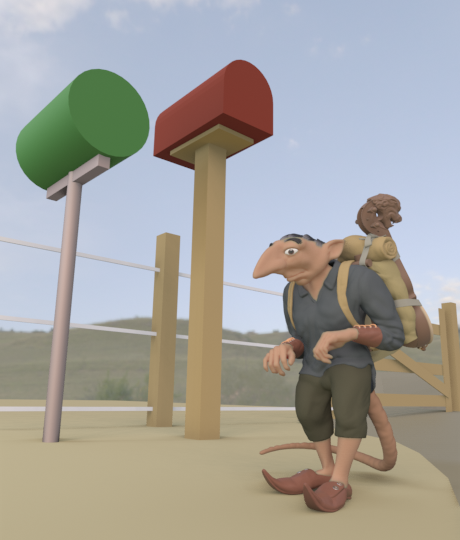
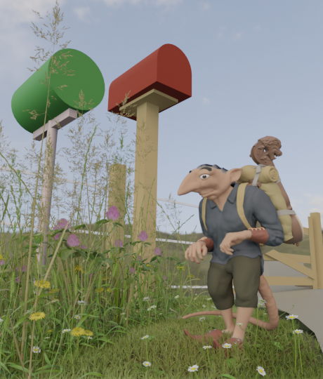
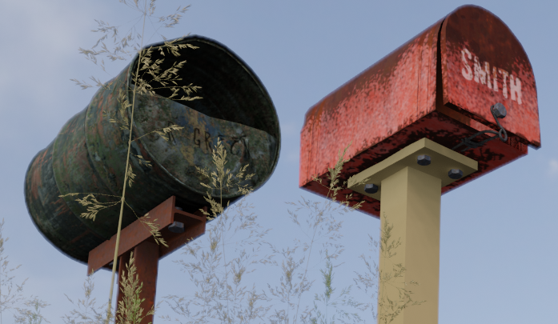
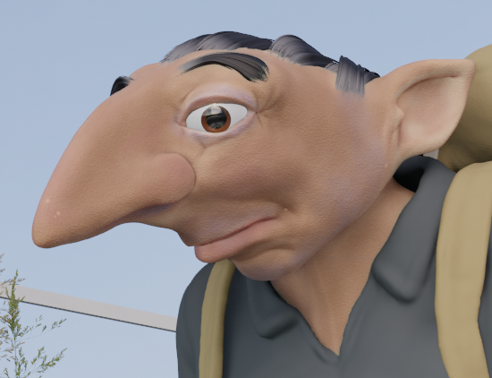
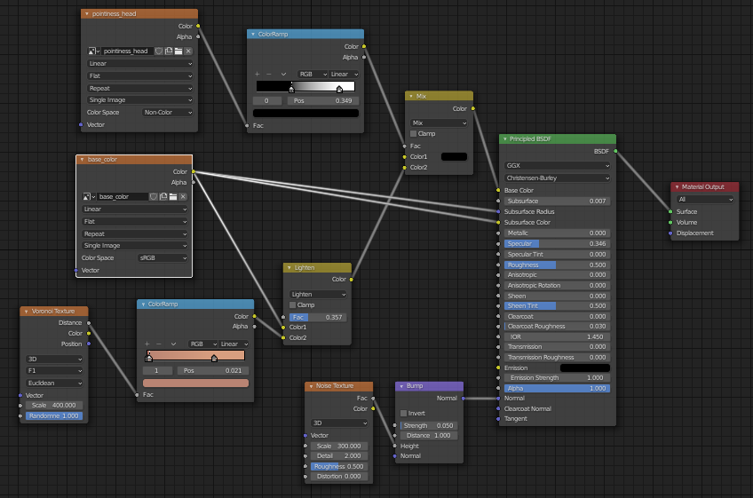
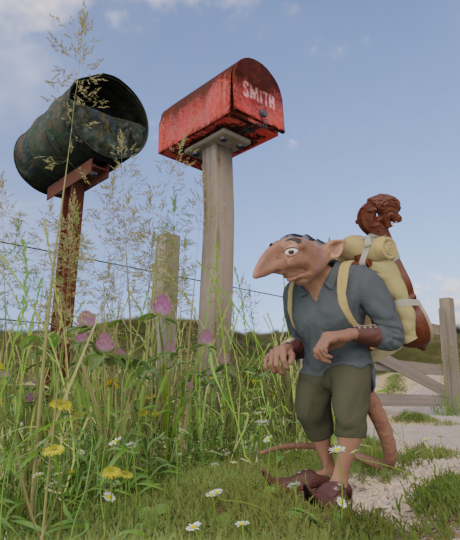
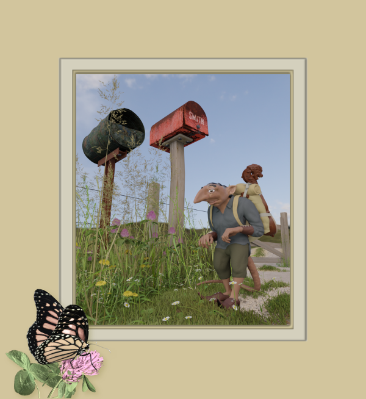

A while after finishing the [imp traveller character](https://elfnor.com/2021-03-17-imp-traveller.html), I wanted to give the character some context in a scene. He's a little fellow only about 40 cm tall, so I needed the scene to give a feel of his small stature, without us looking down as if we're about to step on him.

About this time I visited some friends out of town and took some photos of roadside weeds and rural mail boxes. This gave me the idea for the composition.

I'd also recently bought the [Graswald](https://www.graswald3d.com/) add-on and was keen to play with it.

I textured up the mail boxes playing with the [mask tools](https://www.blendermarket.com/products/mask-tools) add-on. I like the workflow of this for complex layered surfaces

At this stage I was keen to learn the Eevee workflow and explore its capabilities. I also hadn't been that happy with the skin texture and wanted to redo it.

I baked a pointiness map from cycles, and painted a base colour map using texture painting. The skin texture (pores) is just noise maps.

I could have added a hand-painted specular map to add shine to the oily parts of the skin and used some hand painted textures for the normal or bump map, but I liked the non-realistic look I had going.

Here's the skin shader:

Then there was a little more work on the road...

Click through for a larger image (which is actually a cycles render)

After this I experimented with compositing this up as a framed image, looking for a story book cover type effect. The monarch butterfly in the border gave the imp something to look at, but I felt the whole thing didn't quite hang together.

The 3D printed version has now been painted up by the original concept artist and I'll post some photos when I get a sunny day to pose him outside in the ~~weeds~~ garden.
