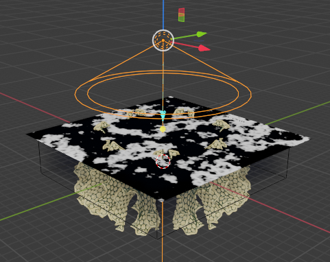

This started out as a piece to figure out how to do underwater caustics in Blender. I liked how it was turning out so I kept going.  It reuses a piece of a hyperbolic plane from an old Processing project.

The code and the base meshes for that Processing project are [here](https://github.com/elfnor/hyperbolic_coral) on github, with an explanation in this [blog post](https://elfnor.com/larger-hyperbolic-tilings-in-3d-using-processing.html).

[4k render](../images/2021-06-06/underwater_111.jpg)

The underwater lighting is very simple, and followed this video [Tutorial-How to setup a underwater scene in Blender 2.8](https://www.youtube.com/watch?v=0Ui-3th9CSg)

The water is just a cuboid with a principled volume shader for the water:

Then there's a plane with a wave texture on top of the water to give some transparent areas:

Set up with a spotlight like this:

The **white** areas of the plane are transparent to the light from above

Here's how it looks with no objects.

The fish are simple low poly objects with 

an image texture projected onto them.

I used Jacques Lucke's Scatter Objects add-on that's bundled with Blender to distribute the weeds rather than the particle systems I've mostly used before. I found this a better way to work than a particle system for a small number of plants (\~100 of each type). I could move the base triangles around to position plants in particular spots. For a particle system this requires either weight painting (where the resolution depends on the mesh geometry) and/or editing the hair system. Scatter Objects is much simpler for small number's of objects. 

This time around I tried to use as few fancy add-ons as possible and a mostly procedural texture workflow (the only image is on the fish), in contrast to some of my other recent projects that have heavily used assets from nature add-ons, PBR textures, and HDRI for lighting.. I haven't blogged these projects yet but have a look on [my artstation](https://www.artstation.com/elfnor) if interested. Each workflow has its place depending on the desired project look and the my inclination at the time.
