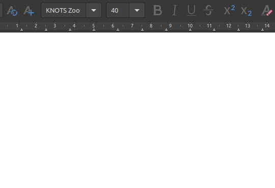
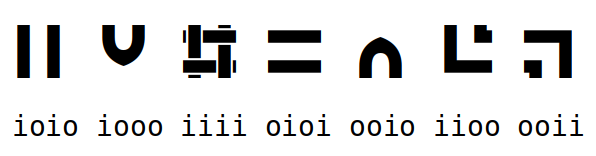
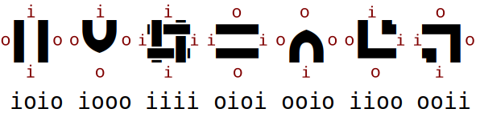
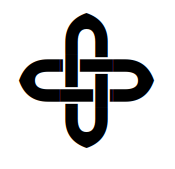
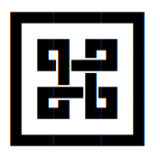
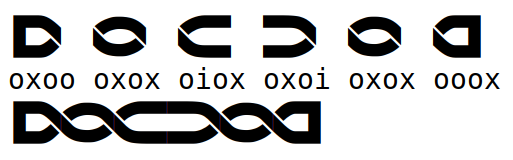
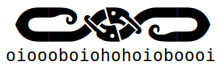
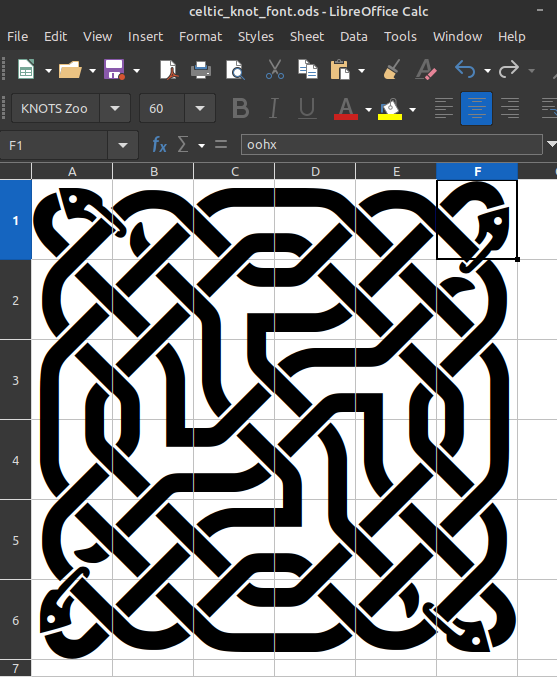
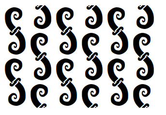

Stumbling around on another project I came across a link on the Wikipedia entry on [Celtic Knots](https://en.wikipedia.org/wiki/Celtic_knot) to  [MrBenGriffin's Celtic Knotwork Generator](https://github.com/MrBenGriffin/Knot). I was intrigued. 

I have little idea how ligatures and fonts work, but I could get this all going fairly simply. I'll detail my exploration here as I found working out what was going on by trial and error rather fun.

I did this using Linux Mint and LibreOffice but other OS and software should work.

Download the zip file of the font from [fontlibrary](https://fontlibrary.org/en/font/knots) or get it with the github repo above. Install it on your system. Right click on one of the font `*.otf` files `Open with Fonts` and click `Install`. (I'm using `KnotsZoo-Rustic.otf` for these examples)

Open LibreOffice Writer and select the `KNOTS Zoo` font and set the font size to say 40.

Start typing a random string of "i" an "o" characters. See if you can figure what's going on.

After a while you should see that a string of four characters produces a glyph.

After some more experimenting you'll find that each character in the string of four refers to one side of the glyph, starting at the top and going clockwise.

An "i" has a connection to the next glyph, an "o" has no connection on that side.

Now see if you can produce this pattern (hint: "oooo" is a blank glyph).

What about this one?

Now start adding "x" characters to the strings.

The full list of characters available is "hibox". "h" gives heads, and "b" beaks or spirals.

For designing patterns LibreOffice Calc is good with four characters or one glyph per cell. its useful in the design stage as you can see the character string in the input line at the same time as you can see the glyph in the cell. You can also easily edit glyph by glyph.

The project's github repository includes a python script to produce patterns with particular dimensions and symmetries. It outputs a sting of characters to the terminal that can be pasted back into your text editor or used on a webpage.

You can also use this font to play with other patterns such as the plane symmetry groups. [Wallpaper group - Wikipedia](https://en.wikipedia.org/wiki/Wallpaper_group)) Or see my old [blog entry](https://elfnor.com/Symmetry%20Group%20Links%20and%20Notation.html)

This one has p2 symmetry. 

Now I could make a font for playing Escher's Potato Game... [Combinatorial enumeration of 2×2 ribbon patterns - ScienceDirect](https://www.sciencedirect.com/science/article/pii/S0195669806000746))

Play that game over here [Escher Tiles - Interaction](http://www.eschertiles.com/interaction.html)
