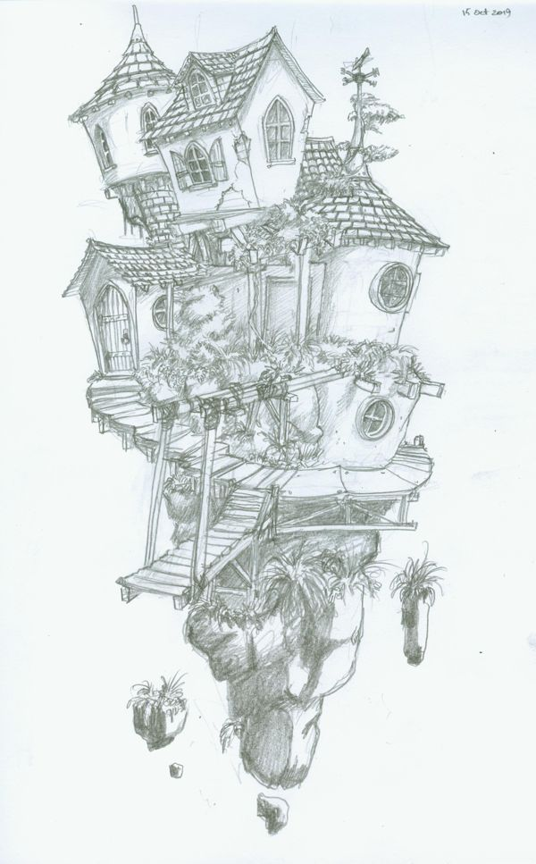
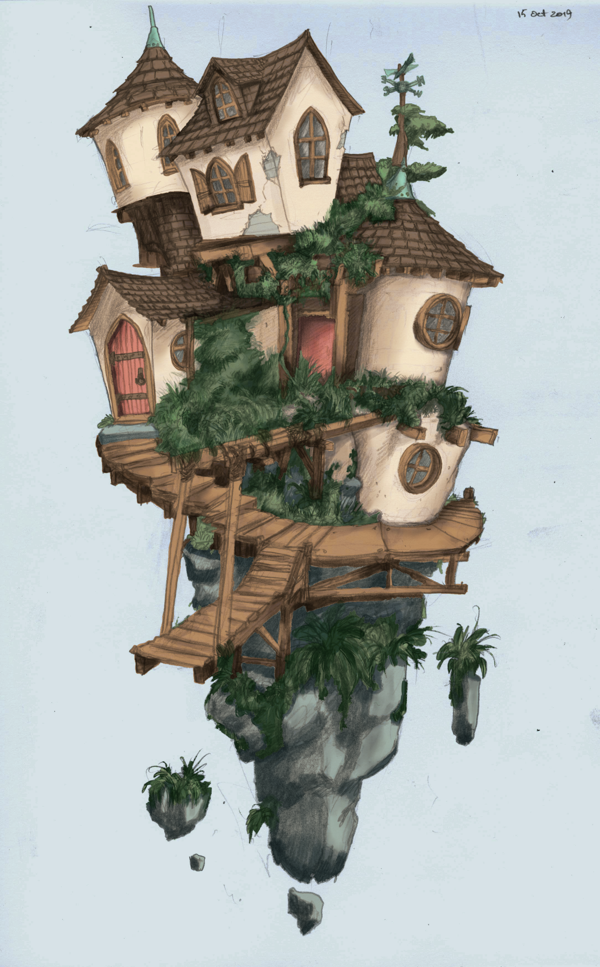
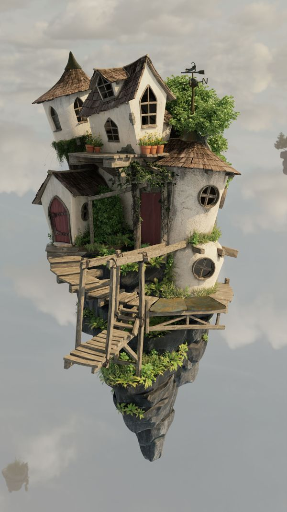
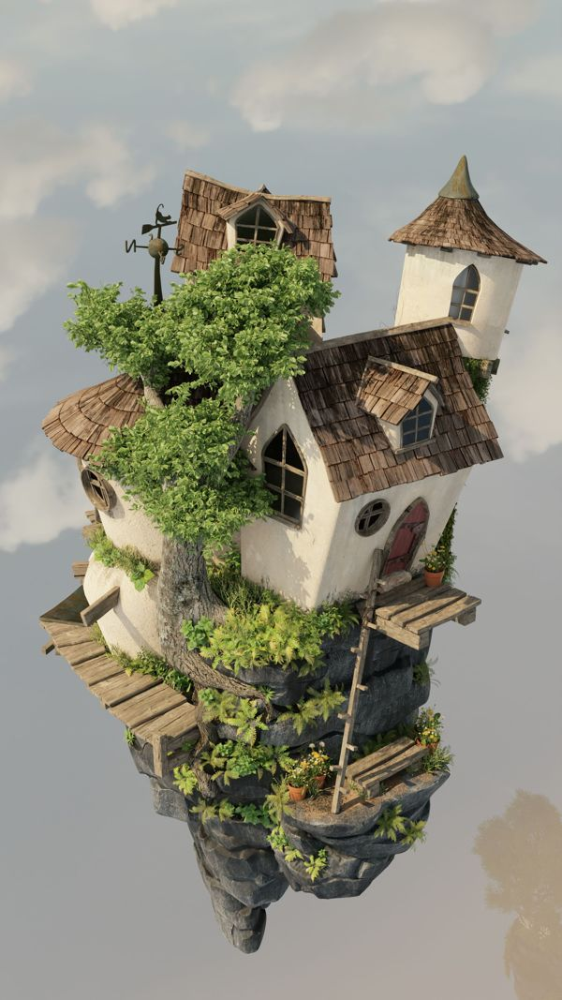

This project started with a sketch my [partner]( https://techmonkeybusiness.com/) drew on a ferry trip. (click through for higher resolution on all the images)

[](../images/2021-09-05/concept-sketch-full.jpg)

I scanned and used the line art to practice with the colorize mask in Krita. [David Revoy's tutorial](https://www.youtube.com/watch?v=HQdx6H9BIGs) is great for this.

[](../images/2021-09-05/krita-colorize-full.png)

I enjoyed working in 2D and thought I'd build the basic rock and building outlines in Blender and go back to Krita for another paint over. But I must be more a 3D than a 2D artist, because I couldn't stop and modelled everything in Blender. This included modelling a plausible back half to the island. Many times I thought I couldn't match the 3D geometry to the 2D sketch, but the concept artist is also a mechanical engineer and I always found a solution that made sense within his world.

[](../images/2021-09-05/island-front-full.jpg)

[](../images/2021-09-05/island-back-full.jpg)

## Video

<iframe width="1280" height="720" src="https://www.youtube.com/embed/7lbz7FWgUZ0?rel=0" title="YouTube video player" frameborder="0" allow="accelerometer; autoplay; clipboard-write; encrypted-media; gyroscope; picture-in-picture" allowfullscreen></iframe>

I put the video (and the stills) through a G'MIC LUT filter (PIXL.US Modern Film at 50% strength). This [post here about how to extract the commands from GIMP](http://gimpchat.com/viewtopic.php?f=10&t=19008) (I did this in Krita instead) was very useful.

The commands for G'MIC 2.9.8 look different from the version used  tutorial but I ended up with the following bash script to run over all the rendered stills from Blender

```bash
#!/bin/bash
mkdir ./done
for i in *png
do
gmic $i -fx_color_presets 19,1,1,1,1,1,1,1,1,1,1,1,1,1,1,1,1,1,1,1,15,1,1,1,1,1,1,512,50,0,0,0,0,0,0,0,50,50,"0","0","0","0","0","0","0","0","0","0","0","0","0","0","0","0","0","0","0","0","0","0","0","0","0","0","0" -o ./done/$i
done
```

## Music

I haven't worked much with music tracks for video, but I wanted a 25 second clip that would loop seamlessly if the fly-around was played continuously. I initially tried doing this with an mp3 track but I couldn't get the bars and phrasing to match the length.

I then tried starting with a midi track. Within LMMS it was easy to identify an 8 bar phrase in my [chosen track](http://midkar.com/country/gone_fishin_mmb.mid) that would  loop well. Cutting just that bit out of the rest of the midi in LMMS seemed harder than it should be. I ended up finding that the export as wav option could be set to only export the part between the loop markers. I then brought the wav into Audacity and used Effect-> Change Speed to make it exactly 25 seconds long.

Overall this was a fun project that took a lot longer than techmonkey took to make that original concept sketch.
