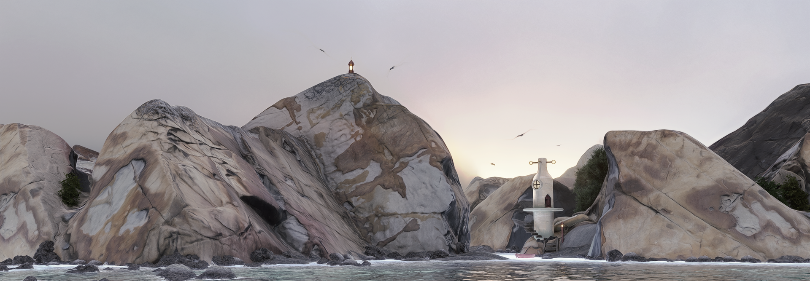
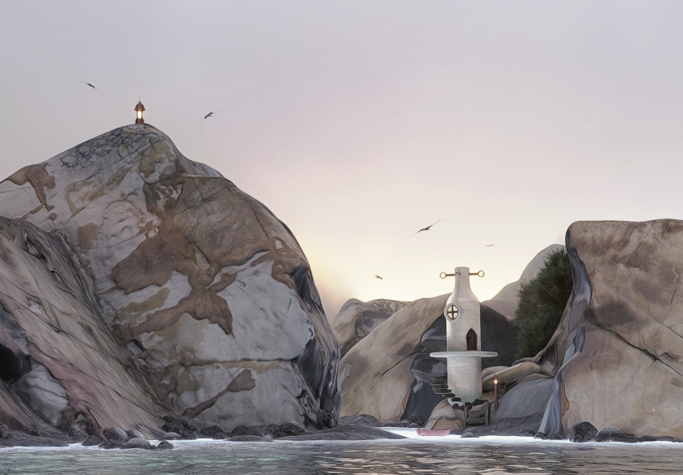
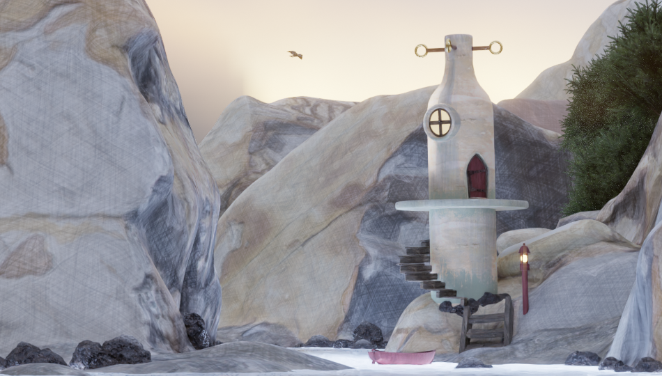
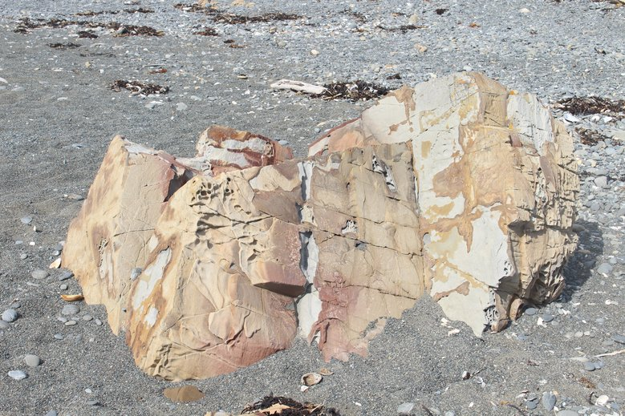

I've been interested in photogrammetry for a long time but struggled to get good results. This year I invested in Creative Shrimp's video [course](https://www.creativeshrimp.com/photogrammetry-course) and its been well worth putting the time into. I'm now really pleased with the large outdoor and smaller turntable models I'm making. I'm using the open-source [Meshroom](https://alicevision.org/) to do the 3D reconstruction.

After scanning lots of stuff, I wanted to do something with it. This piece is a quick kit-bash where the main landforms are from a photogrammetry scan of a rock on a local beach. The original rock is about knee high. The tower is based on a ceramic model I made some years ago. I thought about making a photogrammetry model of it as well, but modelled it directly in Blender as I made some significant changes.

Click to see full size image.

The water is via the [True Terrain](https://www.blendermarket.com/products/true-terrain-) add-on. 

I was after a slight painterly effect so used the low sample count and denoise trick. The image is only rendered with 32 samples but using the OpenImageDenoise smooths this out to the final non-realistic look. The advantages of this are speed, and less need for excessive texture detail. I could have also considered using the denoise in the compositor and only applying to some parts of the image.

I also played around a bit with post processing with G'MIC filters in Krita to go even more toward a a painterly style. This is really easy to overdo. My process is to make a duplicate layer of the original, above the background layer, apply the filter to the duplicate, then reduce the opacity of the duplicate layer until the effect is just there. To record the current state, a new layer can be created from the visible layers (right click in layer panel -> New Layer From Visible). This new layer can then be duplicated, a filter applied and the opacity adjusted as before. Adding the original layer back on top of the layer stack with low opacity (possibly with a colour LUT) can bring back some lost detail or colour. This process give a dynamic workflow with the G'MIC filters.

Mouse over the image to see the original with no G'MIC filters. The filters used are Black & White - Pencil, Artistic - Dream Smoothing and Colors - Color Presets - LUTs Pack PIXLS.US - Modern Film.

I tend to make a lot of duplicate layers, each with single filter. I name each layer after the filter. Then fiddle. It helps to have an example or a clear idea of the style you're aiming for. Otherwise the fiddling can lack direction and not result in much improvement.

Another approach is to filter the images used in the textures before rendering. This has a lot longer feedback time, but can be effective. Each filter layer can be exported separately and then combined in the Shader editor in Blender. This give more control over the strength of each filter. Bolder filters work well for NPR effects.

For example, in Krita I applied a G'MIC Dream Smooth and a Sketch filter to the main rock texture image. 

And here's the original rock on location at the local beach.

